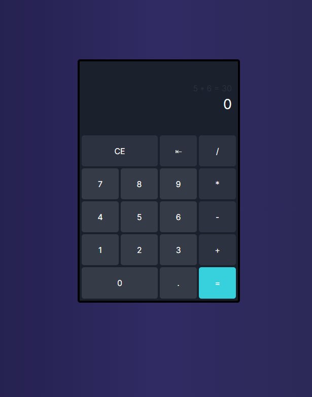

## Calculadora

Projeto desenvolvido com o objetivo de aplicar e consolidar meus conhecimentos sobre o framework Next.js. Além disso, marcou o início dos meus estudos em TypeScript, uma vez que, anteriormente, utilizava exclusivamente JavaScript. Ao concluir o projeto, pude realizar meus primeiros testes unitários.

